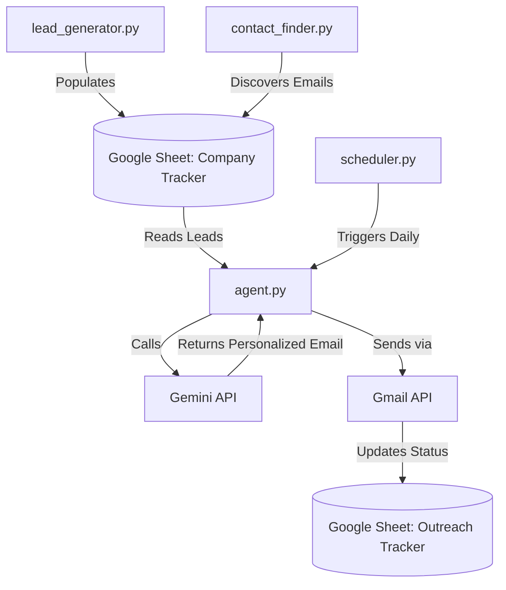

<div align="center">

# 🤖 Autonomous Outreach Agent

[](https://python.org)
[](https://aistudio.google.com/)
[](https://opensource.org/licenses/MIT)

**An intelligent, fully autonomous cold outreach pipeline that runs 24/7, scores leads, drafts hyper-personalized emails via Gemini, sends follow-ups, and auto-syncs with Google Sheets.**

[Features](#-features) • [Quick Start](#-quick-start) • [Deployment](#-pythonanywhere-deployment) • [Architecture](#-architecture)

</div>

---

## ✨ Features

- 🧠 **Gemini-Powered Personalization:** Auto-generates hooks and email body text perfectly tailored to the recipient's role (Recruiter vs. Engineering Manager) and company.
- 🎯 **Autonomous Lead Generation:** Sequentially researches startups globally, moving from Indian tech hubs to YC batches to Silicon Valley automatically.
- 🕵️ **Multi-API Contact Discovery:** Waterfall API usage (`Apollo.io` -> `Snov.io` -> `Hunter.io`) to reliably source contact emails for free.
- ✉️ **Smart Gmail Integration:** Sends emails directly via Gmail API (no SMTP issues), automatically categorizes inbound replies, and stops campaigns for individuals who reply or ask not to be contacted.
- 📊 **Google Sheets CRM Sync:** Acts as a headless CRM, pulling targets from and pushing outcomes directly to your spreadsheet.
- 🕒 **Zero-Maintenance Scheduling:** Deploys easily to cloud services (like PythonAnywhere) to run reliably every day while you sleep.

---

## 🚀 Quick Start (Local Setup)

### 1. Prerequisites
- Python 3.10+ installed
- A Google Cloud Project with **Gmail API**, **Google Sheets API**, and **Google Drive API** enabled.
- A **Gemini API Key** from [Google AI Studio](https://aistudio.google.com/app/apikey).

### 2. Configure Credentials
1. Download your `credentials.json` from the Google Cloud Console (OAuth Desktop App).
2. Create a folder named `.creds` in the root directory.
3. Place `credentials.json` inside the `.creds` folder.

### 3. Setup Google Sheets
The agent acts as a headless CRM using Google Sheets.
1. Create a new, blank Google Sheet.
2. Go to **File -> Import -> Upload** and select `job_search_tracker.xlsx` from this repository.
3. Choose "Replace spreadsheet" and click Import.
4. Copy the Sheet ID from the URL (the part between `/d/` and `/edit`).

### 4. Installation
```bash
git clone https://github.com/YourUsername/outreach_agent.git
cd outreach_agent
pip install -r requirements.txt
```

### 4. Environment Variables & Profile
Copy the environment template and fill in your details:
```bash
cp .env.example .env
```
Inside `.env`, provide your Google Sheet ID, Gmail address, Gemini API Key, and set your desired `EMAILS_PER_DAY`.

Next, define your professional background for the AI to use:
```bash
cp profile.txt.example profile.txt
```
Open `profile.txt` and replace the contents with your own experience and target roles. Gemini will read this file to personalize every email it drafts.
### 5. First Run & Authentication
Run the agent manually the first time. A browser window will pop up asking you to authenticate your Gmail account.
```bash
python agent.py
```
*This securely generates a `token.pickle` inside your `.creds` folder.*

---

## ☁️ PythonAnywhere Deployment

To keep the agent running 24/7 without keeping your laptop open, we recommend deploying to PythonAnywhere.

1. **Upload Files:** Upload your codebase to PythonAnywhere. **Make sure to upload `.creds/token.pickle` and `.creds/credentials.json` from your laptop**, as you cannot authenticate a browser popup on a headless server.
2. **Lock Down Security:** Run the provided security script to strictly lock file permissions (`chmod 600`) so no one else on the shared server can read your API keys.
   ```bash
   python secure_init.py
   ```
3. **Schedule the Task:** Under the **Tasks** tab in PythonAnywhere, schedule a daily task at `12:30` UTC (6:00 PM IST) to run:
   ```bash
   /home/yourusername/.virtualenvs/outreach_env/bin/python /home/yourusername/outreach_agent/scheduler.py --run-now
   ```

---

## 🏗️ Architecture



### Core Components

| Component | Description |
|-----------|-------------|
| 🤖 `agent.py` | The main brain. Scores leads, calls Gemini for email copy, and dispatches to Mailer. |
| 🔍 `lead_generator.py` | Autonomous startup researcher. Finds companies and populates your CRM. |
| 📞 `contact_finder.py` | Orchestrates Apollo, Snov, and Hunter APIs to hunt down verified emails. |
| 📧 `mailer.py` | Handles Gmail API OAuth flow, message sending, and reply extraction. |
| 📝 `sheets.py` | Robust Google Sheets wrapper with automatic retries and error handling. |
| ⏱️ `scheduler.py` | Cron-based trigger using `APScheduler` for autonomous daily execution. |

---

## 🛡️ Security

This project is hardened for cloud deployment:
- **Zero Hardcoded Secrets**: Everything relies on `.env`.
- **Hidden `.creds` Vault**: OAuth tokens are physically segregated into a hidden directory.
- **Headless Safeguards**: Will safely crash with explicit instructions instead of hanging if OAuth tokens expire on a headless server.
- **Linux Permission Lock**: `secure_init.py` automatically implements `chmod 600` on secret files.

---

## 📜 License

This project is licensed under the MIT License. See the [LICENSE](LICENSE) file for details.
