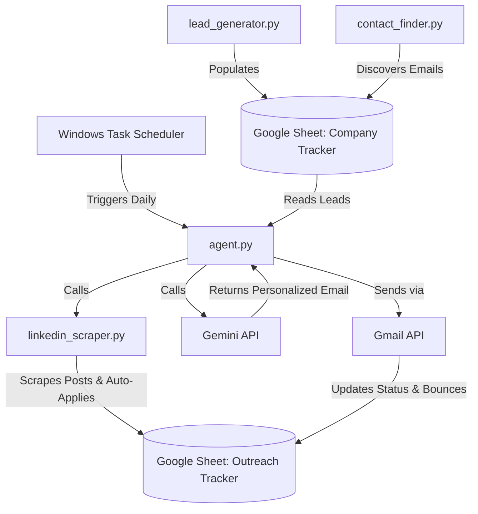

<div align="center">

# 🤖 Autonomous Outreach Agent

[](https://python.org)
[](https://aistudio.google.com/)
[](https://opensource.org/licenses/MIT)

**An intelligent, fully autonomous cold outreach pipeline that runs 24/7, scores leads, drafts hyper-personalized emails via Gemini, sends follow-ups, and auto-syncs with Google Sheets.**

[Features](#-features) • [Quick Start](#-quick-start) • [Deployment](#-pythonanywhere-deployment) • [Architecture](#-architecture)

</div>

---

## ✨ Features

- 🧠 **Gemini-Powered Personalization:** Auto-generates hooks and email body text perfectly tailored to the recipient's role (Recruiter vs. Engineering Manager) and company in a single efficient API call.
- 🎯 **Autonomous Lead Generation:** Sequentially researches tech startups globally, moving from Indian tech hubs to YC batches to Silicon Valley automatically.
- 💼 **LinkedIn Auto-Apply & Scraper:** Authenticates via Playwright to scrape the LinkedIn feed, search, and Jobs sections for relevant hiring posts. Autonomously navigates the "Easy Apply" process for entry-level jobs and stores direct links.
- 🕵️ **Multi-API Contact Discovery:** Waterfall API usage (`Apollo.io` -> `Snov.io` -> `Hunter.io`) to reliably source contact emails for free.
- ✉️ **Smart Gmail Integration & Deduplication:** Sends emails directly via Gmail API. Syncs replies, identifies "Address not found" bounce notifications (automatically clearing them to find new contacts), and strictly deduplicates against your Gmail "Sent" folder so you never double-email a lead.
- 📊 **Google Sheets CRM Sync:** Acts as a headless CRM, pulling targets from and pushing outcomes directly to your spreadsheet.
- 🕒 **Zero-Maintenance Scheduling:** Sets up a Windows Task Scheduler job to run automatically when you log in—limited to once per day.

---

## 🚀 Quick Start (Local Setup)

### 1. Prerequisites
- Python 3.10+ installed
- A Google Cloud Project with **Gmail API**, **Google Sheets API**, and **Google Drive API** enabled.
- A **Gemini API Key** from [Google AI Studio](https://aistudio.google.com/app/apikey).

### 2. Configure Credentials
1. Download your `credentials.json` from the Google Cloud Console (OAuth Desktop App).
2. Create a folder named `.creds` in the root directory.
3. Place `credentials.json` inside the `.creds` folder.

### 3. Setup Google Sheets
The agent acts as a headless CRM using Google Sheets.
1. Create a new, blank Google Sheet.
2. Go to **File -> Import -> Upload** and select `job_search_tracker.xlsx` from this repository.
3. Choose "Replace spreadsheet" and click Import.
4. Copy the Sheet ID from the URL (the part between `/d/` and `/edit`).

### 4. Installation
```bash
git clone https://github.com/YourUsername/outreach_agent.git
cd outreach_agent
pip install -r requirements.txt
```

### 5. Personalize Your Agent (Environment & Profile)

The agent needs to know who you are to write convincing emails on your behalf. You must set up two files:

**A. The Environment Variables (`.env`)**
Copy the template to create your `.env` file:
```bash
cp .env.example .env
```
Open `.env` in any text editor and fill in your details. You **must** provide:
- `YOUR_NAME`: Your full name (e.g. "Jane Doe")
- `YOUR_LINKEDIN`: Link to your LinkedIn profile
- `YOUR_RESUME`: A public link to your resume (e.g. a Google Drive link)
- `SENDER_EMAIL`: The Gmail address you will use to send emails
- `SPREADSHEET_ID`: The ID of your Google Sheet from Step 3
- `GEMINI_API_KEY`: Your Google AI Studio API key

**B. Your Professional Profile (`profile.txt`)**
Copy the profile template:
```bash
cp profile.txt.example profile.txt
```
Open `profile.txt` and write a brief summary of your background. **Gemini reads this file to write the emails.** Include:
- Your current role and years of experience
- Key projects, metrics, or achievements you want to highlight
- The specific roles you are targeting (e.g. "Product Manager", "Backend Engineer")
Make sure to remove the placeholder text!
### 6. First Run & Authentication

> [!WARNING]
> **Use a burner/fake LinkedIn account!** LinkedIn aggressively bans accounts for scraping. Do **not** use your primary LinkedIn account to log in. Create a separate account specifically for this agent to avoid losing your network.

Run the agent manually the first time. Two browser windows will pop up sequentially:
1. First, you will be asked to authenticate your **Gmail account** (this generates `token.pickle` securely on your machine).
2. Next, a separate browser will open for you to log into your **LinkedIn account**. Once you log in and see the feed, return to the terminal and press Enter to save the session.

```bash
python agent.py
```
---

## ☁️ PythonAnywhere / Cloud Deployment

To keep the agent running 24/7 without keeping your laptop open, we recommend deploying to PythonAnywhere or similar.

1. **Upload Files:** Upload your codebase. **Make sure to upload `.creds/token.pickle` and `.creds/credentials.json` from your laptop**, as you cannot authenticate a browser popup on a headless server.
2. **Lock Down Security:** Run the provided security script to strictly lock file permissions (`chmod 600`) so no one else on the shared server can read your API keys.
   ```bash
   python secure_init.py
   ```
3. **Schedule the Task:** Under the **Tasks** tab in PythonAnywhere, schedule a daily task at `12:30` UTC (6:00 PM IST) to run `agent.py`.

---

## 🏗️ Architecture



### Core Components

| Component | Description |
|-----------|-------------|
| 🤖 `agent.py` | The main brain. Scores leads, calls Gemini for email copy, and dispatches to Mailer. |
| 🔍 `lead_generator.py` | Autonomous startup researcher. Finds companies and populates your CRM. |
| 💼 `linkedin_scraper.py` | Headless Playwright scraper that extracts LinkedIn hiring posts and auto-applies to jobs. |
| 📞 `contact_finder.py` | Orchestrates Apollo, Snov, and Hunter APIs to hunt down verified emails. |
| 📧 `mailer.py` | Handles Gmail API OAuth flow, message sending, duplicate checking, and bounce extraction. |
| 📝 `sheets.py` | Robust Google Sheets wrapper with automatic retries and error handling. |
| ⏱️ `setup.bat` | Registers Windows Task Scheduler to run `run_agent.bat` daily on logon. |

---

## 🛡️ Security

This project is hardened for cloud deployment:
- **Zero Hardcoded Secrets**: Everything relies on `.env`.
- **Hidden `.creds` Vault**: OAuth tokens are physically segregated into a hidden directory.
- **Headless Safeguards**: Will safely crash with explicit instructions instead of hanging if OAuth tokens expire on a headless server.
- **Linux Permission Lock**: `secure_init.py` automatically implements `chmod 600` on secret files.

---

## 📜 License

This project is licensed under the MIT License. See the [LICENSE](LICENSE) file for details.
